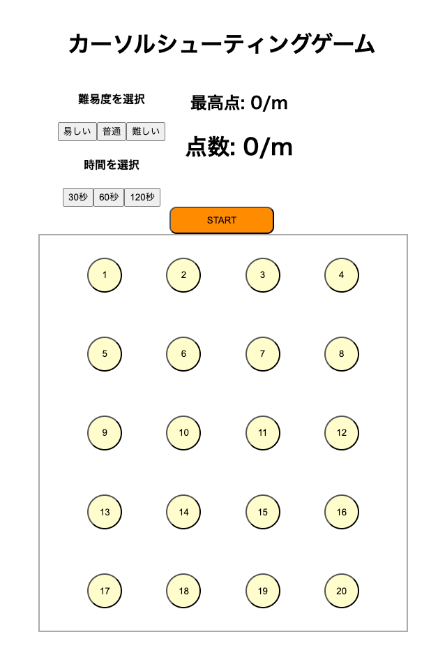

## 1.プロジェクト概要

# カーソルシューティングゲーム

### 概要

```
このアプリケーションは、トラックボールを買いたてで慣れていないトラックボール初心者を対象としたアプリです。
このアプリではニックネームを設定することでそのニックネームでデーターを保存できるようになっているます。
そして、難易度や制限時間も設定することができるのでより自分になったプレイをすることができます！！
```

### 遊び方

```
1、 ニックネームを入力します。
2、 難易度を選択します。
3、 制限時間を選択します。
4、 STARTボタンをおしてゲーム開始です。
5、 制限時間を過ぎると今までの最高得点と比較して最高得点を上回ったら最高点を更新します。
6、 CONTINUEボタンを押してもう一度ゲームを始めます。
```

### スクリーンショット




## 2.技術スタック

```
- データベース：PostgreSQL
- その他の技術：react-confetti(紙吹雪)
```

### フロントエンド

```
- Vite
- React Router (ルーティング)
```

### バックエンド

```
- SpringBoot
- Kotlin
- jdbcTemplate
```

 
## 3.セットアップ手順

### DB

```
psql
CREATE DATABASE cursor_game;

// migrate 実行
\q
./gradlew build
./gradlew bootrun
```

### フロントエンド

```
cd src/main/resources/static/frontend/
npm install
npm run dev
```

